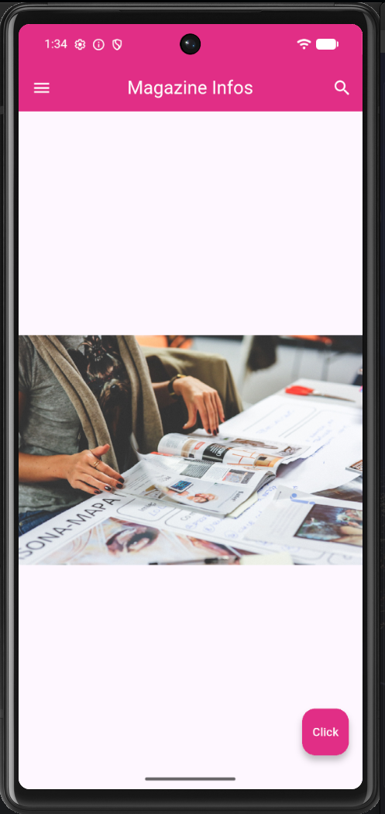

# Activité 4.1 – Magazine Infos (Première version)

Première application Flutter respectant le Material Design : AppBar, image principale et FloatingActionButton.

## Aperçu



## Prérequis

- Flutter SDK installé ([guide d'installation](https://docs.flutter.dev/get-started/install))
- Un émulateur Android/iOS ou un appareil physique connecté

## Installation

```bash
git clone https://github.com/DavFilsDev/activite1.git
cd activite1
flutter pub get
flutter run
```

## Structure du projet

- `lib/main.dart` : point d'entrée (`main()`), `MonAppli` et `pageAccueil`
- `assets/images/` : ressources images de l'application

## Fonctionnalités

- AppBar avec titre centré, icône menu et icône recherche
- Image principale du magazine
- FloatingActionButton affichant un message au clic